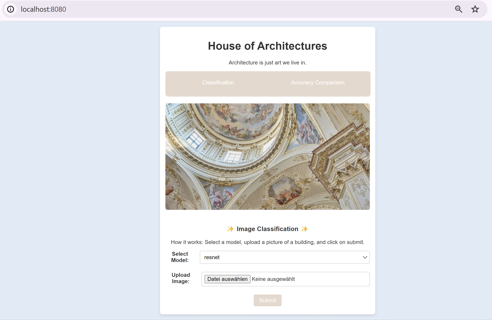

# House of Architectures 🏛️
This project aims to classify different architectural styles based on images.

## Content
- [Project goal / Motivation](#project-goal--motivation)
- [Data Collection](#data-collection)
- [Modeling](#modeling)
- [Validation](#validation)
- [Interpretation](#interpretation)
- [How to use](#how-to-use)
- [Installation](#installation)
- [Explanation Files & Folders](#explanation-files--folders)

## Project goal / Motivation
**Project goal:**
Development of an image classification system that analyses images of buildings and identifies the corresponding architectural style (e.g. Baroque, Modern, Brutalism, Futurism, etc.).

**Motivation:** 
I find the topic of architectural style classification very interesting. A system that can recognise different architectural styles would provide valuable information to architects, historians and urban planners.
Accurately recognising architectural styles not only helps historians and architects, but also promotes cultural understanding and the preservation of our architectural heritage. Furthermore, such a system could be used in urban planning to preserve or specifically develop the character of a neighbourhood.
Another advantage is that it helps tourists and people without in-depth architectural knowledge (like myself :smiley: ) to better understand the different styles and their historical significance. This promotes cultural awareness and enriches the travelling experience.

## Data Collection
Kaggle - Architectural styles [Kaggle - Architectural styles](https://www.kaggle.com/datasets/dumitrux/architectural-styles-dataset)
This dataset contains 10113 images from 25 architectural styles.
Name and Number of images for each Architecture Style:
- Achaemenid architecture: 393
- American craftsman style: 364
- American Foursquare architecture: 362
- Ancient Egyptian architecture: 406
- Art Deco architecture: 566
- Art Nouveau architecture: 615
- Baroque architecture: 456
- Bauhaus architecture: 315
- Beaux-Arts architecture: 424
- Byzantine architecture: 313
- Chicago school architecture: 278
- Colonial architecture: 480
- Deconstructivism: 335
- Edwardian architecture: 280
- Georgian architecture: 381
- Gothic architecture: 331
- Greek Revival architecture: 523
- International style: 417
- Novelty architecture: 382
- Palladian architecture: 343
- Postmodern architecture: 322
- Queen Anne architecture: 720
- Romanesque architecture: 301
- Russian Revival architecture: 352
- Tudor Revival architecture: 455

## Modeling
In this project, i experimented with various deep learning models to classify architectural styles. My primary goal was to achieve high accuracy through iterative refinement and fine-tuning. Below is an overview of the models used and the strategies employed to optimize their performance.

### Models Used
#### ArchiNet
- A custom convolutional neural network (CNN)
- Sequential architecture with multiple convolutional, pooling, dropout, and batch normalization layers to enhance feature extraction and model stability.

#### Custom CNN Model
- A custom-designed CNN for this dataset.
- Emphasized simplicity and efficiency while maintaining robust feature learning capabilities.

#### ResNet50
- A pre-trained  model known for its deep residual learning capabilities.
- Fine-tuned for this dataset by adding custom layers and freezing the base model layers.

#### InceptionV3
- A pre-trained model, renowned for its inception modules that capture multi-scale features.
- Fine-tuned similarly by adding custom top layers and freezing the pre-trained layers.
- Best Accuracy with this one

### Fine-Tuning and Optimization
To maximize the performance of the model, i implemented the following:

#### Layer Customization and Freezing
- For pre-trained models like ResNet50 and InceptionV3, I added custom top layers tailored to my classification task.
- I froze the base layers to retain the pre-trained weights, ensuring that the models leveraged their pre-existing feature extraction capabilities.

#### Hyperparameter Tuning
- Experimented with different learning rates, batch sizes, and optimizer configurations to identify the best settings for each model.
- Used callbacks like EarlyStopping and ReduceLROnPlateau to prevent overfitting and dynamically adjust learning rates.

#### Data Augmentation
- Applied various data augmentation techniques using a custom image generator.
- Enhanced the diversity and quantity of training data, helping the models generalize better to unseen examples.

#### Iterative Refinement
- Trained each model for multiple epochs, continuously monitoring performance metrics.
- Made iterative adjustments based on the training and validation accuracy and loss, aiming for the highest possible accuracy.

## Validation
To ensure the robustness and reliability of the models, I implemented a thorough validation process. Below is a summary of the validation approach and the performance of the models:

### Model Performance Summary
- ArchiNet: Validation Accuracy: 0.201
- Custom CNN Model: Validation Accuracy: 0.239
- ResNet50 (10 epochs): Validation Accuracy: 0.190
- ResNet50 (20 epochs): Validation Accuracy: 0.210
- InceptionV3 (10 epochs): Validation Accuracy: 0.508
- InceptionV3 (20 epochs): Validation Accuracy: 0.530
- InceptionV3 (50 epochs): Validation Accuracy: 0.540

### Data Splitting and Augmentation
#### Data Preparation
- I used the ImageDataGenerator class from TensorFlow Keras to handle data preparation and augmentation.
- The dataset was split into training and validation sets with a 80-20 split, using data augmentation techniques to enhance the robustness of the models.

#### Data Augmentation
- Applied transformations such as shear, zoom, horizontal flip, rotation, width shift, height shift, and brightness adjustment to the training data.
- This approach helped in making the models more generalizable and less prone to overfitting.

#### Training and Validation Generators
Training Data Generator

```bash
train_datagen = ImageDataGenerator(
    rescale=1./255,
    shear_range=0.2,
    zoom_range=0.2,
    horizontal_flip=True,
    rotation_range=20,
    width_shift_range=0.2,
    height_shift_range=0.2,
    brightness_range=[0.8, 1.2],
    validation_split=0.2
)

train_generator = train_datagen.flow_from_directory(
    data_dir,
    target_size=(224, 224),
    batch_size=32,
    class_mode='categorical',
    subset='training'
)
```
Validation Data Generator
```bash
validation_generator = train_datagen.flow_from_directory(
    data_dir,
    target_size=(224, 224),
    batch_size=32,
    class_mode='categorical',
    subset='validation'
)
```
## Interpretation
While some models have achieved validation accuracies above 50%, there are several factors influencing the overall performance. For instance, the validation accuracy for the Custom CNN Model is around 24%, which, although better than random guessing, is not sufficient for professional use.

A likely reason for the varied performance is the imbalance in the dataset. The number of images per class ranges significantly, leading to the model being biased towards the more represented classes. For instance, some classes have as few as 301 images, while others have up to 720. This imbalance causes the model to be heavily influenced by the more represented classes. Addressing this by augmenting the data for underrepresented classes or collecting more images would likely improve the model's accuracy.

Another challenge is the complexity and variability within the image data. For example, different architectural styles can vary widely even within the same category, making it harder for the model to generalize. Additionally, architectural images might include diverse features like interiors, exteriors, and different perspectives, adding another layer of complexity.

Despite these challenges, I am satisfied with the progress made. The InceptionV3 model, especially after fine-tuning, shows promising results with validation accuracies above 50%. This suggests that with further data augmentation, fine-tuning, and perhaps leveraging more sophisticated architectures, the models could achieve even higher performance.

Given the ambitious nature of the task—classifying diverse architectural styles with limited and imbalanced data—the results demonstrate significant potential. Continued efforts to balance the dataset and refine the models could lead to even better accuracy, making these models more viable for professional use in the future.

## How To Use
### Download the Project Folders
- Download this Project and open in Visual Studio
- Download the Project Folder "HouseOfArchitectures": [Folder "HouseOfArchitectures](https://drive.google.com/drive/folders/1GDFngxERKNzKRhV1xxc2KGME3y7bMFQt?usp=sharing)
### Set up the Project
- Unzip the downloaded folder
- Copy the "data" and "models" directories into the backend folder.
### Start the Backend Server
```bash
cd backend
python app.py
```
### Start the Frontend Server
```bash
cd frontend
npm run dev
```
### Open the Application in your Browser
- Go to http://localhost:8080/
- It should look like that:
  
  If the layout is not as expected, try zooming out in your browser.
### Using the Application
- Classification: Click on "Classification," upload an image, and get the classification result.
- Accuracy Comparison: Click on "Accuracy Comparison" to check the validation accuracy and loss of the models.

## Installation
### Install Requirements
```bash
pip install -r requirements.txt
```
### Flask Backend
1. Install flask
    ```bash
    pip install flask
    pip freeze > requirements.txt
    ```
2. Create and style app.py
3. Start Flask Backend:
    ```bash
    python app.py
    ```
### Frontend
1. Create Svelte Project: 
    ```bash
    npx degit sveltejs/template frontend
    ```
    --> I had to manually create a folder named 'npm' under C:\Users\athika\AppData\Roaming
2. Go to folder frontend
    ```bash
    cd frontend
    ```
3. Install npm & other libraries
    ```bash
    npm install
    nmp install axios
    npm install svelte-routing
    ```
4. Start Frontend:
    ```bash
    npm run dev
    ```

## Explanation Files & Folders
### Folders
- backend/: all files for the backend.
- data/: contains all the images required for training, validation, and testing of the model. The data is categorized by different architectural styles.
- models/: Stores the trained models and their architectures, allowing them to be easily loaded or distributed.
- results/results.json: contains detailed training metrics for various machine learning models, including ArchiNet, Custom CNN Model, ResNet50, and InceptionV3. It documents the models' training and validation accuracy and loss over a series of epochs, providing insights into their performance and learning progress.
- scripts/: This folder contains Python scripts for specific tasks such as training the model, preparing the data, or evaluation.
- frontend/ : all files for the frontend.
- README.md: Overview over this Project. This File ;)
- requirements.txt: File with all required libraries and dependencies for this project.

### Scripts
- check_file.py: Checks if files in a specified directory can be opened without errors.
- data_preparation.py: Prepares and augments image data for training and validation by creating data generators that load images from a specified directory, apply various transformations, and split the data into training and validation subsets.
- predict.py: This script loads a pre-trained model and uses it to predict the architectural style of an image provided as a command-line argument.
- rename_images.py: This script recursively traverses a directory containing images, renames each image file by incorporating the folder name and a counter, and ensures that the new file names are unique by replacing spaces with underscores and incrementing the counter as needed.
- train_archinet_model.py: defines and trains an ArchiNet model for classifying architectural styles, using a convolutional neural network (CNN) architecture.
- train_custom_model.py: defines and trains a custom convolutional neural network (CNN) model for classifying architectural styles. It preprocesses the data, trains the model, saves the trained model and training results, and appends the results to an existing JSON file.
- train_inceptionv3_model.py: trains a custom InceptionV3 model on a dataset, applying transfer learning by using a pre-trained InceptionV3 model with added custom top layers. The training process includes saving the trained model and logging the training and validation accuracies and losses, which are then stored in a JSON file for later analysis.
- train_resnet_model.py: trains a custom ResNet50 model using transfer learning by leveraging a pre-trained ResNet50 model with added custom top layers. It logs the training and validation accuracies and losses, saving both the trained model and the results in specified directories.
